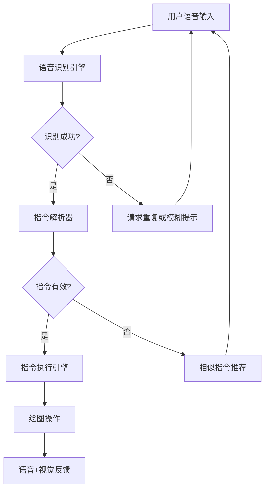

# 语音绘图工具 - 产品需求文档

## 1. 产品概述

**产品名称：** 声画 (VoiceCanvas)

**一句话简介：** 一款仅通过语音指令即可完成绘图的创新创意工具，让用户摆脱鼠标和键盘的束缚，释放双手进行艺术创作。

**核心价值：**
- 零门槛绘图：无需学习复杂的软件操作，张口即画
- 专注创意：双手解放，思维与创作同步
- 创新体验：全新的语音交互模式带来趣味性和科技感

**目标用户：**
- 创意表达者：需要快速记录灵感的设计师
- 行动不便者：无法使用传统输入设备的用户
- 追求新奇的用户：对新型交互方式感兴趣的人群

## 2. 核心功能

### 2.1 功能模块

#### 2.1.1 语音指令系统
- **语音唤醒**：通过"嘿，画画"或"开始绘图"激活绘图模式
- **实时语音识别**：将用户语音实时转换为可执行的绘图指令
- **指令解析引擎**：将自然语言指令转换为绘图操作
- **指令确认反馈**：通过语音和视觉双重确认用户指令

#### 2.1.2 绘图引擎
- **画布管理**：创建、切换、清空画布
- **基本图形绘制**：线条、圆形、矩形、三角形
- **自由绘画**：支持自由路径绘制
- **颜色控制**：支持中英文颜色名称识别
- **画笔属性**：线条粗细、透明度控制

#### 2.1.3 智能指令拆解
- **复合指令处理**："画一个大的红色圆圈"自动拆解为多个操作
- **模糊指令理解**：支持同义词、近义表达
- **指令修正**：用户可通过语音修正错误操作

#### 2.1.4 用户反馈系统
- **语音反馈**：系统通过语音确认执行的指令
- **视觉反馈**：画布上实时显示操作预览
- **错误提示**：识别失败时给出清晰的错误信息和建议

### 2.2 支持的语音指令类型

| 指令类别 | 示例指令 | 功能描述 |
|---------|---------|---------|
| 基础操作 | "开始绘图"、"清空画布"、"撤销" | 画布控制 |
| 图形绘制 | "画一个圆"、"画一条线"、"画矩形" | 基本图形 |
| 位置尺寸 | "在中间"、"大一点"、"往左" | 位置和尺寸调整 |
| 颜色控制 | "用红色"、"换成蓝色" | 颜色切换 |
| 画笔属性 | "粗一点"、"细线"、"半透明" | 线条属性 |
| 自由绘画 | "画一朵云"、"画一棵树" | 简易图形绘制 |

## 3. 核心流程

### 3.1 用户交互流程

```
用户说话 → 语音识别 → 指令解析 → 指令验证 → 执行操作 → 反馈确认
```

### 3.2 语音指令处理流程



## 4. 用户界面设计

### 4.1 设计风格

**设计理念：** 极简主义 + 声波可视化

**视觉特征：**
- 深色主题为主，突出画布内容
- 以声波、音符为视觉元素贯穿界面
- 毛玻璃效果增强层次感
- 柔和的渐变色彩

**配色方案：**
- 主色调：#1a1a2e（深空蓝）
- 次要色：#16213e（深海蓝）
- 强调色：#e94560（活力红）/ #0f3460（靛蓝）
- 画布背景：#ffffff 或透明
- 文字色：#eaeaea（主文字）、#a0a0a0（次要文字）

**字体选择：**
- 主标题：Noto Sans SC Bold
- 正文：Noto Sans SC Regular
- 数字/状态：JetBrains Mono

**动画效果：**
- 语音输入时：声波动画涟漪效果
- 操作确认时：脉冲式反馈动画
- 图形绘制时：渐进式线条动画

### 4.2 页面布局

```
┌─────────────────────────────────────────────┐
│  状态栏：当前模式 | 监听状态 | 颜色指示器    │
├─────────────────────────────────────────────┤
│                                             │
│                                             │
│              绘 图 画 布                     │
│           (占据主要空间)                     │
│                                             │
│                                             │
├─────────────────────────────────────────────┤
│  声波可视化区域 + 指令日志滚动显示           │
└─────────────────────────────────────────────┘
```

### 4.3 响应式设计

- 桌面端优先设计
- 平板设备自适应布局
- 不考虑移动端（语音输入为主要交互方式）

## 5. 技术实现

### 5.1 技术栈

- **前端框架**：React 18 + Vite
- **样式方案**：Tailwind CSS
- **语音识别**：Web Speech API (Chrome内置)
- **画布技术**：HTML5 Canvas / SVG
- **状态管理**：React Context + useReducer

### 5.2 核心模块

| 模块 | 职责 | 技术方案 |
|-----|------|---------|
| SpeechRecognizer | 语音识别与处理 | Web Speech API |
| CommandParser | 指令解析与意图识别 | 正则 + 关键词匹配 |
| CanvasEngine | 图形渲染与绑定 | HTML5 Canvas |
| FeedbackManager | 用户反馈管理 | Web Speech Synthesis + 视觉动画 |

### 5.3 容错机制

- 模糊指令匹配：支持同义词、近义词
- 指令重复确认：高风险操作需要二次确认
- 自动纠错：根据上下文推测用户意图
- 降级策略：无法识别时提供备选指令

## 6. 性能指标

- 语音识别延迟：< 500ms
- 指令解析延迟：< 200ms
- 绘图响应延迟：< 100ms
- 整体操作延迟：< 1s

## 7. 语音指令能力清单

### 7.1 计划支持指令（规划中）

#### 画布控制
- [ ] "开始绘图" / "停止绘图"
- [ ] "清空画布" / "重来"
- [ ] "撤销" / "重做"

#### 图形绘制
- [ ] "画一个圆" / "画圆形"
- [ ] "画一个矩形" / "画方块"
- [ ] "画一条线" / "画直线"
- [ ] "画三角形"
- [ ] "画椭圆"

#### 位置与尺寸
- [ ] "在中间" / "往左" / "往右" / "往上" / "往下"
- [ ] "大一点" / "小一点"
- [ ] "放大" / "缩小"

#### 颜色控制
- [ ] "用红色" / "换成蓝色" 等基本颜色
- [ ] "深色" / "浅色" 修饰词
- [ ] "随机颜色"

#### 画笔属性
- [ ] "粗一点" / "细一点"
- [ ] "实线" / "虚线"
- [ ] "半透明" / "不透明"

#### 复合指令
- [ ] "画一个大的红色圆圈"
- [ ] "在左边画一个小三角形"
- [ ] "用粗线画一条虚线"

### 7.2 优先级排序

**P0（核心功能）：**
- 语音监听开关
- 基本图形绘制（圆、矩形、线条）
- 颜色切换
- 清空画布

**P1（重要功能）：**
- 画笔粗细调整
- 位置调整
- 撤销操作

**P2（增强功能）：**
- 复合指令解析
- 自由绘画
- 虚线/实线切换

**P3（规划功能）：**
- 图形填充
- 渐变色支持
- 保存/导出功能
