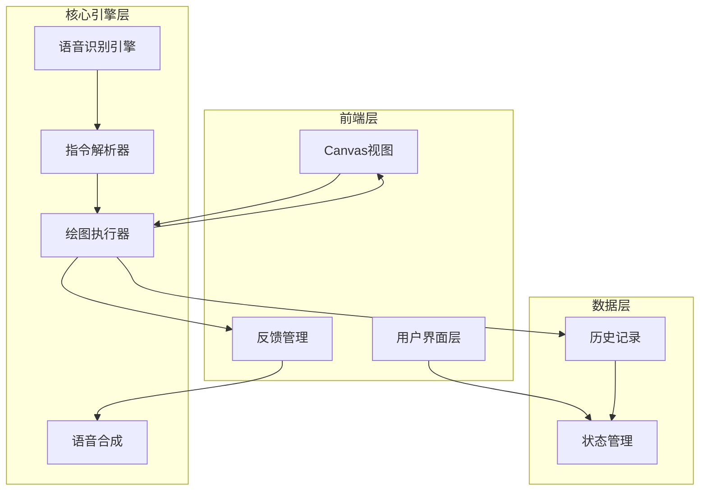

# 语音绘图工具 - 技术架构文档

## 1. 架构设计



## 2. 技术选型

| 类别 | 技术 | 说明 |
|-----|------|-----|
| 框架 | React 18 | 组件化架构，状态管理便捷 |
| 构建工具 | Vite | 快速热更新，开发体验好 |
| 样式 | Tailwind CSS | 原子化CSS，快速定制UI |
| 语音识别 | Web Speech API | 浏览器内置，无需额外依赖 |
| 语音合成 | Web Speech Synthesis API | 浏览器内置，语音反馈 |
| 画布 | HTML5 Canvas | 高性能绑定绑定绑定绑定绑定绑定绑定 |
| 状态管理 | React Context + useReducer | 轻量级，无需额外依赖 |

## 3. 目录结构

```
voice-canvas/
├── public/
│   └── favicon.ico
├── src/
│   ├── components/
│   │   ├── Canvas/
│   │   │   └── DrawingCanvas.tsx
│   │   ├── Feedback/
│   │   │   ├── VoiceWave.tsx
│   │   │   └── CommandLog.tsx
│   │   ├── Status/
│   │   │   └── StatusBar.tsx
│   │   └── Layout/
│   │       └── MainLayout.tsx
│   ├── core/
│   │   ├── speech/
│   │   │   ├── SpeechRecognizer.ts
│   │   │   └── SpeechSynthesizer.ts
│   │   ├── parser/
│   │   │   ├── CommandParser.ts
│   │   │   └── CommandPatterns.ts
│   │   ├── engine/
│   │   │   ├── DrawingEngine.ts
│   │   │   └── shapes/
│   │   │       ├── Shape.ts
│   │   │       ├── Circle.ts
│   │   │       ├── Rectangle.ts
│   │   │       ├── Line.ts
│   │   │       └── Triangle.ts
│   │   └── history/
│   │       └── HistoryManager.ts
│   ├── contexts/
│   │   └── DrawingContext.tsx
│   ├── hooks/
│   │   ├── useSpeechRecognition.ts
│   │   └── useDrawing.ts
│   ├── types/
│   │   └── index.ts
│   ├── utils/
│   │   ├── colorMap.ts
│   │   └── constants.ts
│   ├── App.tsx
│   ├── main.tsx
│   └── index.css
├── index.html
├── package.json
├── vite.config.ts
├── tailwind.config.js
└── tsconfig.json
```

## 4. 核心模块设计

### 4.1 语音识别模块 (SpeechRecognizer)

**职责：**
- 初始化 Web Speech API
- 监听用户语音输入
- 处理识别结果和错误

**接口设计：**
```typescript
interface SpeechRecognizer {
  start(): void;
  stop(): void;
  onResult(callback: (text: string) => void): void;
  onError(callback: (error: string) => void): void;
  isListening(): boolean;
}
```

### 4.2 指令解析器 (CommandParser)

**职责：**
- 解析自然语言指令
- 提取意图和参数
- 处理模糊匹配和纠错

**支持的指令模式：**
```typescript
type CommandIntent =
  | 'START'
  | 'STOP'
  | 'CLEAR'
  | 'UNDO'
  | 'REDO'
  | 'DRAW_SHAPE'
  | 'CHANGE_COLOR'
  | 'CHANGE_SIZE'
  | 'CHANGE_POSITION'
  | 'CHANGE_STROKE'
  | 'FREE_DRAW';

interface ParsedCommand {
  intent: CommandIntent;
  shape?: ShapeType;
  color?: string;
  size?: number;
  position?: Position;
  stroke?: StrokeType;
  confidence: number;
}
```

### 4.3 绘图引擎 (DrawingEngine)

**职责：**
- 管理画布状态
- 执行绘图操作
- 维护历史记录

**核心操作：**
```typescript
interface DrawingEngine {
  drawShape(shape: Shape): void;
  setColor(color: string): void;
  setStrokeWidth(width: number): void;
  setStrokeType(type: 'solid' | 'dashed'): void;
  clear(): void;
  undo(): void;
  redo(): void;
  getCanvas(): HTMLCanvasElement;
}
```

### 4.4 语音合成模块 (SpeechSynthesizer)

**职责：**
- 将文本转换为语音
- 提供操作反馈

**接口设计：**
```typescript
interface SpeechSynthesizer {
  speak(text: string): void;
  setVolume(volume: number): void;
  setRate(rate: number): void;
}
```

## 5. 数据模型

### 5.1 绘图状态

```typescript
interface DrawingState {
  isListening: boolean;
  currentColor: string;
  strokeWidth: number;
  strokeType: 'solid' | 'dashed';
  shapes: Shape[];
  history: HistoryEntry[];
  historyIndex: number;
}
```

### 5.2 图形定义

```typescript
interface Shape {
  id: string;
  type: 'circle' | 'rectangle' | 'line' | 'triangle' | 'free';
  position: { x: number; y: number };
  size?: { width?: number; height?: number; radius?: number };
  color: string;
  strokeWidth: number;
  strokeType: 'solid' | 'dashed';
  points?: { x: number; y: number }[]; // 用于自由绘制
}

interface HistoryEntry {
  action: 'add' | 'clear' | 'undo' | 'redo';
  shapes: Shape[];
  timestamp: number;
}
```

## 6. 指令解析策略

### 6.1 解析流程

```
1. 标准化输入（去除噪音、转小写）
2. 正则匹配指令模式
3. 提取参数（颜色、尺寸、位置）
4. 计算置信度
5. 返回解析结果
```

### 6.2 颜色映射表

```typescript
const COLOR_MAP: Record<string, string> = {
  '红色': '#e94560',
  '蓝色': '#0f3460',
  '绿色': '#00a878',
  '黄色': '#ffd60a',
  '橙色': '#ff9500',
  '紫色': '#9b59b6',
  '黑色': '#000000',
  '白色': '#ffffff',
  '灰色': '#808080',
  '粉色': '#ff6b9d',
  '青色': '#00bcd4',
  '棕色': '#795548',
};
```

### 6.3 同义词处理

```typescript
const SHAPE_SYNONYMS: Record<string, string[]> = {
  '圆': ['圆形', '圆圈', 'circle', '循环'],
  '矩形': ['方块', '方形', '长方形', 'rectangle', '方'],
  '线': ['直线', '线段', 'line'],
  '三角形': ['三角', 'triangle'],
};
```

## 7. 性能优化

### 7.1 语音识别优化
- 使用 continuous 模式减少延迟
- 设置适当的 interimResults 平衡速度和准确性

### 7.2 画布渲染优化
- 使用 requestAnimationFrame 批量渲染
- 增量更新而非全量重绘

### 7.3 状态管理优化
- 使用 Immer 避免不必要的状态复制
- 合理拆分 Context 减少重渲染

## 8. 浏览器兼容性

- **推荐浏览器**：Chrome 90+（完整支持 Web Speech API）
- **部分支持**：Edge 90+
- **不支持**：Safari、Firefox（语音识别功能受限）

## 9. 错误处理策略

| 错误类型 | 处理方式 |
|---------|---------|
| 语音识别失败 | 提示用户"请再说一次" |
| 指令无法解析 | 提供相似指令建议 |
| 浏览器不支持 | 显示兼容性提示 |
| 画布操作失败 | 回退到上一个有效状态 |
